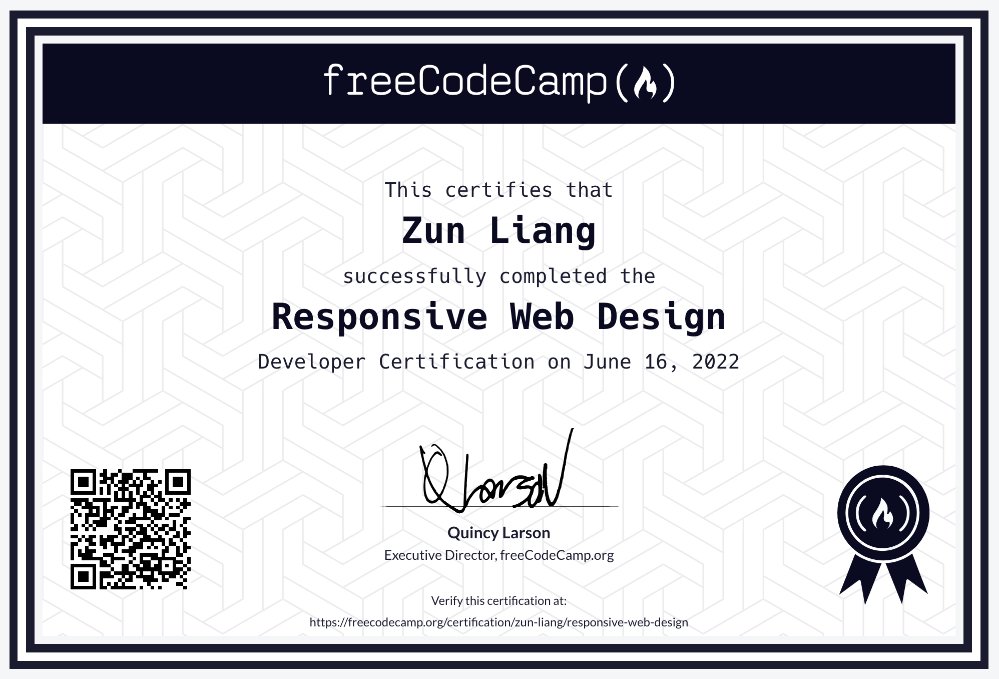
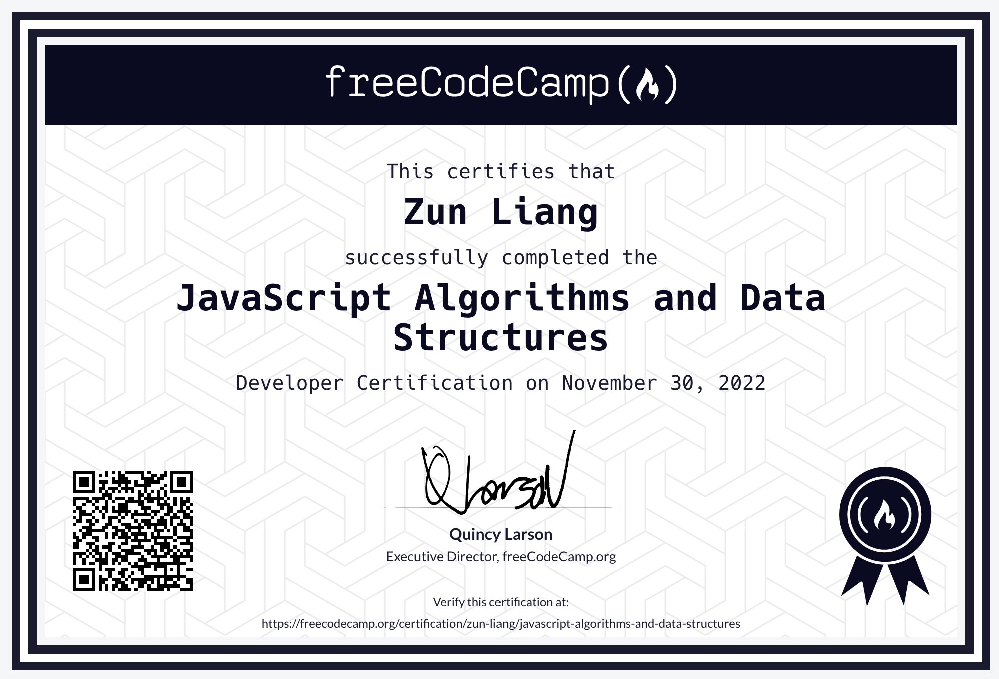
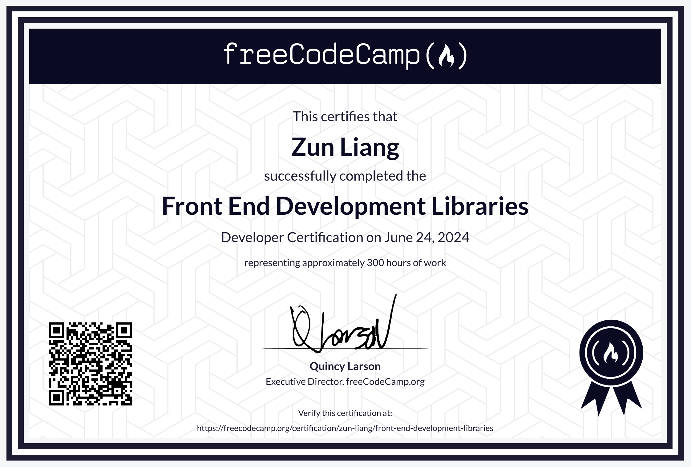
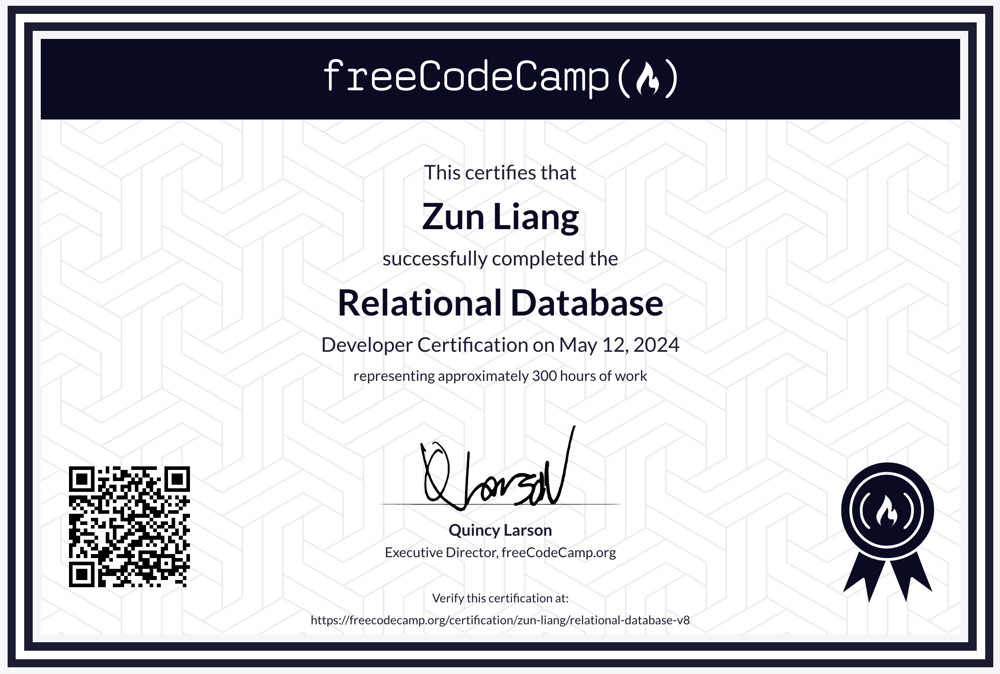
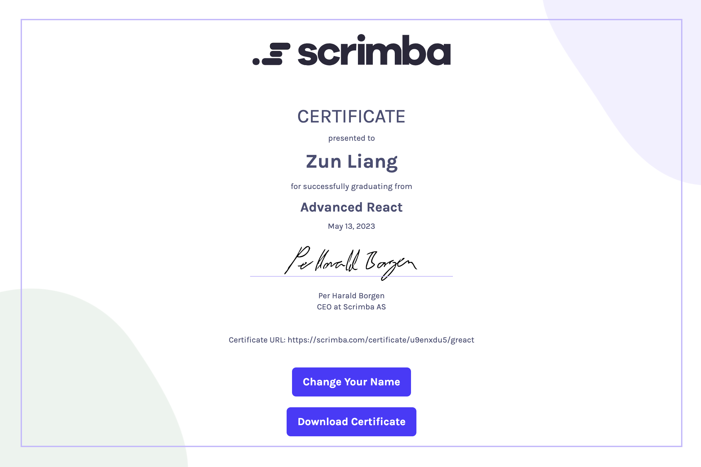
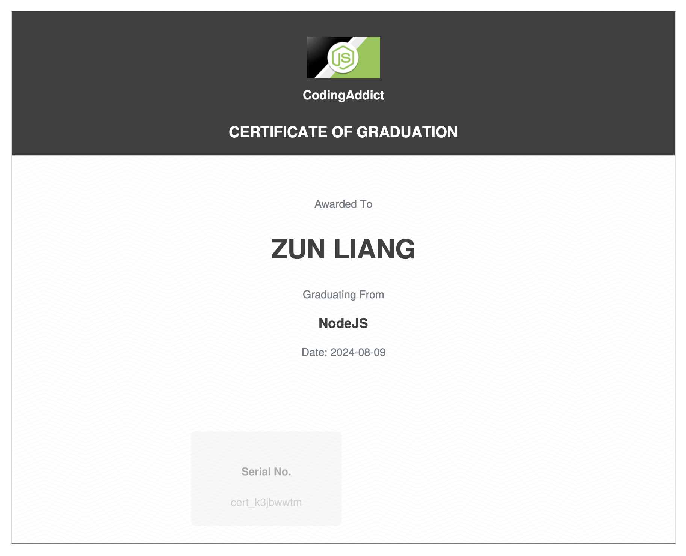
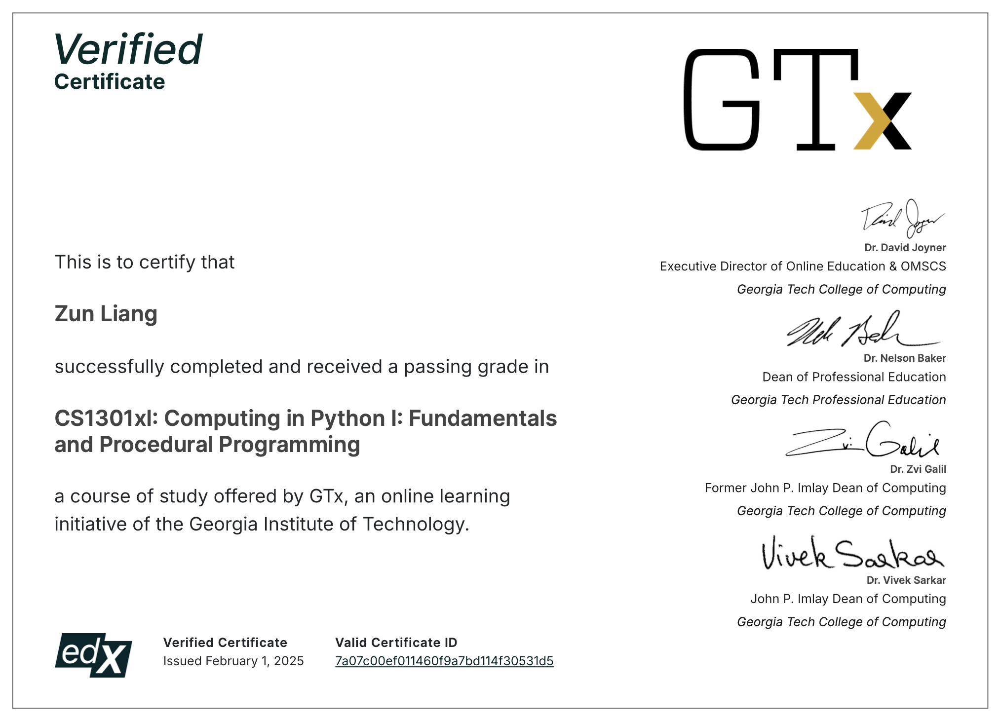
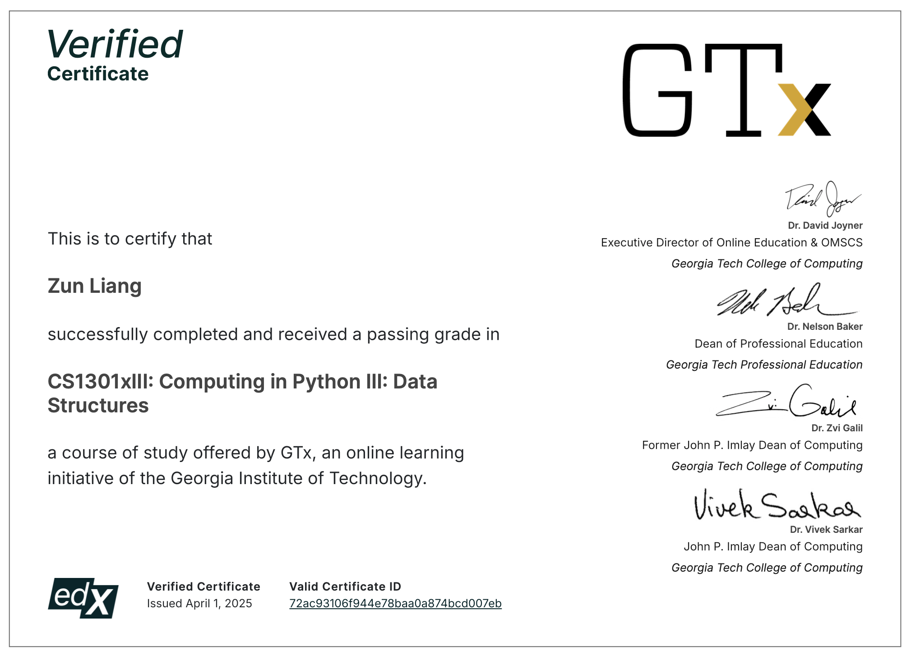

# Certificates and Achievements

## FreeCodeCamp

### 🏆 Responsive Web Design Certification

Verify this certification at [FreeCodeCamp](https://www.freecodecamp.org/certification/zun-liang/responsive-web-design)

### 🏆 JavaScript Algorithms and Data Structures Certification

Verify this certification at [FreeCodeCamp](https://www.freecodecamp.org/certification/zun-liang/javascript-algorithms-and-data-structures)

### 🏆 Front End Development Libraries Certification

Verify this certification at [FreeCodeCamp](https://www.freecodecamp.org/certification/zun-liang/front-end-development-libraries)

### 🏆 Relational Database Certification

Verify this certification at [FreeCodeCamp](https://www.freecodecamp.org/certification/zun-liang/relational-database-v8)

## Scrimba

### 🏆 Advanced React

Verify this certificate at [Scrimba](https://scrimba.com/certificate/u9enxdu5/greact)

## CodingAddict

### 🏆 NodeJS

## Edx

### 🏆 GTx CS1301xI: Computing in Python I: Fundamentals and Procedural Programming

Verify this certificate at [Edx](https://courses.edx.org/certificates/7a07c00ef011460f9a7bd114f30531d5?_gl=1*1pxcxj5*_gcl_au*MTcyMjA1NzM1OC4xNzMwOTE4OTI1*_ga*MTc2MjMyNTY4Mi4xNzMwOTE4OTI1*_ga_D3KS4KMDT0*MTczODY4OTg3MS40MC4xLjE3Mzg2OTAxMTAuNTkuMC4w)

### 🏆 GTx CS1301xII: Computing in Python II: Control Structures

Verify this certificate at [Edx](https://courses.edx.org/certificates/6c608f372f3f4a53a5b0c46f311624ff?_gl=1*1kj7roz*_gcl_au*MTIyMTQxNjg4NS4xNzM4Nzk4ODQ5*_ga*MTc2MjMyNTY4Mi4xNzMwOTE4OTI1*_ga_D3KS4KMDT0*MTc0MTg5MTU3OC45MS4xLjE3NDE4OTMwNTMuNjAuMC4w)

### 🏆 GTx CS1301xIII: Computing in Python III: Data Structures

Verify this certificate at [Edx](https://courses.edx.org/certificates/72ac93106f944e78baa0a874bcd007eb?_gl=1*11kqmct*_gcl_au*MTIyMTQxNjg4NS4xNzM4Nzk4ODQ5*_ga*MTc2MjMyNTY4Mi4xNzMwOTE4OTI1*_ga_D3KS4KMDT0*czE3NDYyODYwMDQkbzE2NiRnMSR0MTc0NjI4NzAwMiRqMzgkbDAkaDA.)

## Linkedin Learning

### 🏆 Career Essentials in Generative AI by Microsoft and Linkedin

Verify this certification at [Linkedin Learning](https://www.linkedin.com/learning/certificates/3bca94f0d7d422424959625d39c58b2dfc16d25cba7f083ea23390185ba2527c)
